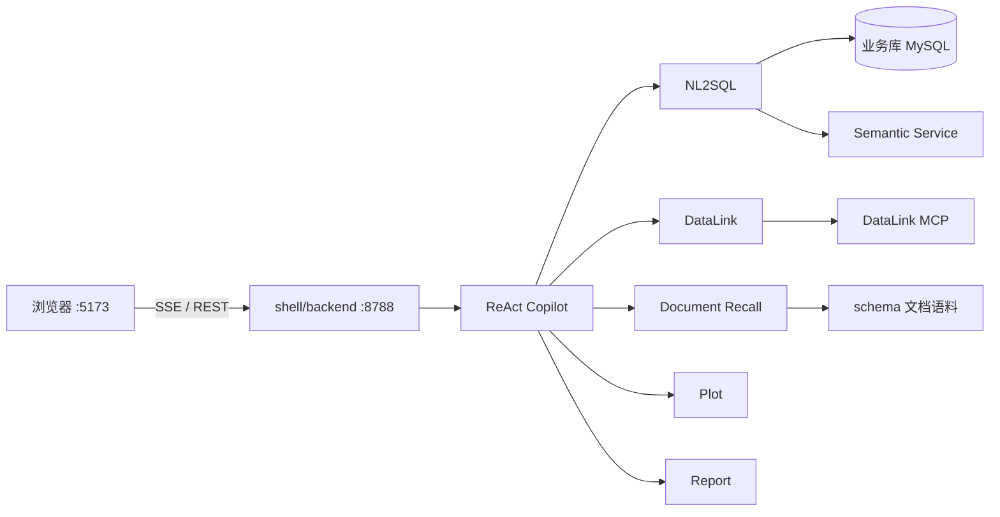

# DataX

用自然语言问数、看表、出图、写报告。主 Agent 只负责对话和路由，查数、口径和画图交给子 Agent。

<p>
  
  
  
</p>

## 能做什么

用户只需要说话。Copilot 按问题类型委派：

| 你想问 | 谁来做 |
|--------|--------|
| 数量、列表、统计、对比、排名 | NL2SQL（只读查库） |
| 表怎么 JOIN、字段是否同义 | DataLink |
| 口径、字段含义、业务规则 | Document Recall |
| 折线 / 柱状 / 饼图 | 先查数，再 Plot |
| 写成文档 | Report（不查库） |

界面会同时给出对话结论、本轮委派 DAG，以及 SQL / 表 / 图 / 报告。

仓库里带了一份示例场景（房产测绘核对库 `landcheck`），用来跑通整条链路。换成自己的库时，改 YAML、数据源和文档语料即可，不必改壳。

## 架构



```text
shell/web            对话工作台、DAG、产物栏
        ↕ SSE / REST
shell/backend        Profile、会话、把内核流转成壳事件
        ↕ SDK
dataagent/           Agent 内核（YAML 编排、NL2SQL、子 Agent）
        ↕
MySQL / Semantic Service / DataLink MCP   外部依赖，不在本仓库
```

壳协议、Profile 和 SSE 事件见 [shell/README.md](shell/README.md)。

## 目录

```text
dataagent/     内核
shell/         Web 壳 + 后端
schema/        示例场景：建表、语义 seed、文档召回语料
pyproject.toml Python 依赖
.env.example   环境变量模板
```

Semantic Service、本地会话和密钥不在本仓库。Python 包导入路径是 `dataagent`。

## 环境要求

| 依赖 | 说明 |
|------|------|
| Python 3.11+ | 推荐 `uv` |
| Node.js 20+ | `shell/web` |
| MySQL | 示例库名 `landcheck`，也可换成自己的库 |
| Semantic Service | NL2SQL 语义层，默认 `:32000` |
| DataLink MCP | 可选；不问表关系可以先不启 |
| LLM | 任意 OpenAI 兼容接口 |

## 快速开始

### 1. 安装

```bash
git clone https://github.com/HongxHH/DataX.git
cd DataX
uv sync --extra server --extra nl2sql
cp .env.example .env
```

编辑 `.env`：填入 `OPENAI_BASE_URL` / `OPENAI_API_KEY` / `OPENAI_MODEL`，以及 MySQL、`SEMANTIC_LAYER_BASE_URL`。

语义层布置见 [`schema/SEMANTIC_SETUP.md`](schema/SEMANTIC_SETUP.md)，示例库说明见 [`schema/README.md`](schema/README.md)。

### 2. 启动后端

```powershell
$env:PYTHONUTF8 = "1"
uv run python shell/backend/main.py
```

默认 `http://127.0.0.1:8788`。

### 3. 启动前端

```bash
cd shell/web
npm install
npm run dev
```

浏览器打开 **http://127.0.0.1:5173**。默认 Profile 为 `landcheck-copilot`。

密钥只放在 `.env`，不要提交。`DATAAGENT_REPO_ROOT` 由 `shell/backend/main.py` 自动注入。会话写在 `shell/.sessions/`。

## 换成自己的数据

1. 准备只读业务库，把 `.env` 里的 `MYSQL_*` / `DATASOURCE_DATABASE_ADDRESS` 指过去
2. 复制 `dataagent/core/flex/examples/landcheck_*.yaml`，改库名、路由说明、子 Agent 路径
3. 把文档口径放到类似 `schema/landcheck_docs/` 的目录，并写入对应 YAML 的 `allow_path`
4. 在 `shell/profiles/` 增加 Profile，或把 `SHELL_PROFILE` 指到新配置

YAML 使用 `$env{VAR_NAME}` 引用环境变量，壳不感知具体业务库。

## License

Apache License 2.0，见 [LICENSE](LICENSE)。内核源自 [DataAgent](https://gitcode.com/datagallery/dataagent)，署名见 [NOTICE](NOTICE)。
