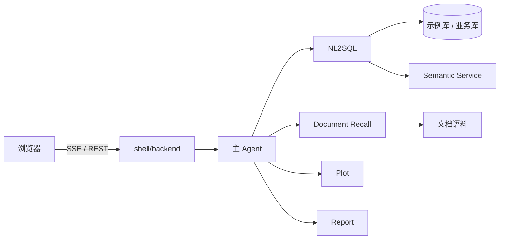

# DataX

面向数据分析的多 Agent Copilot。主 Agent 拆任务，查数、口径、画图、报告在子进程里执行；查询只读，大结果落盘，上下文只留摘要。

<p>
  
  
  
</p>

## 界面

四张图放到 [`docs/images/`](docs/images/README.md)。截法见该目录说明。

**工作台** · `docs/images/workbench.png`


一次问数结束后的整窗：会话、对话、委派 DAG、右侧 SQL / 表。

**委派** · `docs/images/delegation.png`


主 Agent 拆成 NL2SQL → 画图（或报告）的过程，DAG 和产物栏都要能看见。

**上下文** · `docs/images/context.png`


同一会话追问后，打开上下文占用 / Prompt 清单，能看出大结果没有整段进 prompt。

**轨迹** · `docs/images/trajectory.png`


打开轨迹面板，能看到本轮节点阶段或 span。

## 一次提问会走什么

| 你想问 | 谁来做 |
|--------|--------|
| 数量、列表、统计、对比、排名 | NL2SQL（只读查库） |
| 口径、字段含义、业务规则、表怎么 JOIN | Document Recall |
| 折线 / 柱状 / 饼图 | 先查数，再 Plot |
| 写成文档 | Report（不查库） |

主 Agent 只对话和路由。仓库带了一份示例库，用来跑通链路；换成自己的库时改 YAML、数据源和文档语料，不必改壳。

## 运行时

- 一次运行分成准备 / 执行 / 收尾；Agent、节点、工具上的钩子用 YAML 注册。
- 子 Agent 跑在独立子进程里，相关追问可以复用同一个 worker。
- NL2SQL：感知缩表 → 多候选生成 → AST 只读校验 → 反思 → 执行 → 选择。写库在校验阶段拦住。
- 大结果落盘，上下文只留路径和摘要。上面四张图对应的就是委派、产物、占用和轨迹。

```text
感知 → 生成 → 校验 → 反思 → 执行 → 选择
```

## 架构



```text
shell/web        对话、DAG、产物栏
      ↕
shell/backend    会话、把内核流转成壳事件
      ↕
dataagent/       YAML 运行时、NL2SQL、子 Agent
      ↕
MySQL / Semantic Service    外部依赖，不在本仓库
```

壳协议见 [shell/README.md](shell/README.md)。

## 快速开始

Python 3.11+、Node.js 20+、MySQL、Semantic Service（默认 `:32000`）、任意 OpenAI 兼容模型。

```bash
git clone https://github.com/HongxHH/DataX.git
cd DataX
uv sync --extra server --extra nl2sql
cp .env.example .env
```

`.env` 里填写 `OPENAI_BASE_URL` / `OPENAI_API_KEY` / `OPENAI_MODEL`，以及 MySQL 和 `SEMANTIC_LAYER_BASE_URL`。示例库的表结构和语义布置见 [`schema/`](schema/)。

```powershell
$env:PYTHONUTF8 = "1"
uv run python shell/backend/main.py
```

```bash
cd shell/web
npm install
npm run dev
```

浏览器打开 **http://127.0.0.1:5173**，默认加载仓库内的示例库。密钥只放 `.env`。Python 导入名仍是 `dataagent`。

## 换成自己的数据

1. 把 `.env` 里的数据源指到只读业务库
2. 复制 `dataagent/core/flex/examples/` 下的示例 YAML，改路由和子 Agent 路径
3. 把口径文档放到 `schema/` 下的语料目录，写入对应 YAML 的 `allow_path`
4. 在 `shell/profiles/` 增加 Profile，或设置 `SHELL_PROFILE`

YAML 用 `$env{VAR_NAME}` 引用环境变量，壳不感知具体业务库。

## License

Apache License 2.0，见 [LICENSE](LICENSE)。内核源自 [DataAgent](https://gitcode.com/datagallery/dataagent)，署名见 [NOTICE](NOTICE)。
